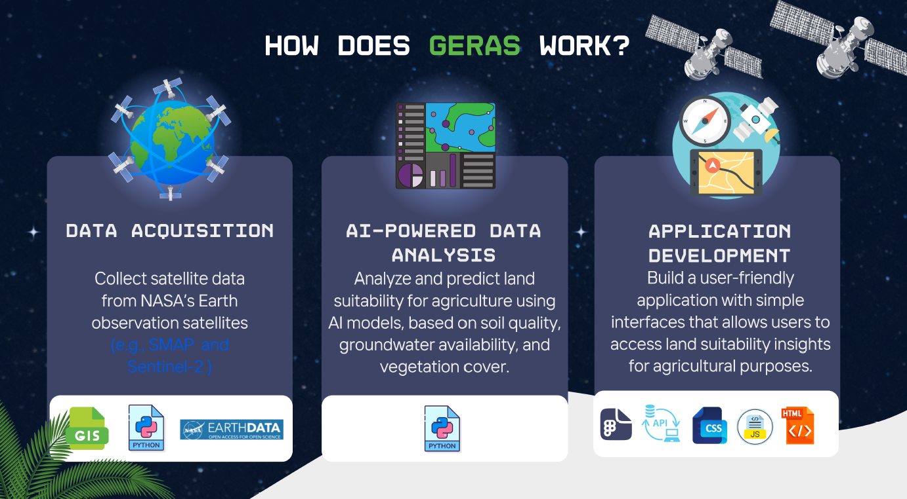

## 🌱 Gheras – Smart Agriculture for a Sustainable Future
🚀 This project was developed for the NASA Space Apps Challenge 2024, where we proudly won **1st place in the local edition – Saudi Arabia**. 🌍🏆
Note: All code and interfaces included here are preliminary prototypes and are still under development.

### Overview
Gheras is a project designed to help farmers and government entities make informed agricultural decisions using artificial intelligence and satellite data (such as SMAP and Sentinel-2).
The project addresses challenges like vegetation decline, reduced productivity, and water scarcity by analyzing land suitability for agriculture.

 ### Target Audience
- Farmers
- Government entities
- Investors in the agricultural sector
- Agricultural researchers

### Interfaces
Initial UI designs have been created

### How Does Geras Work ?

